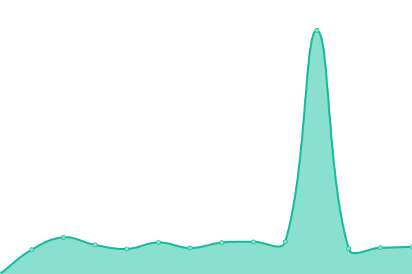
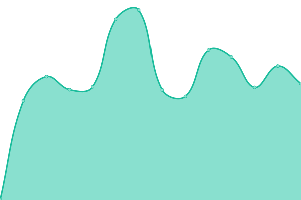
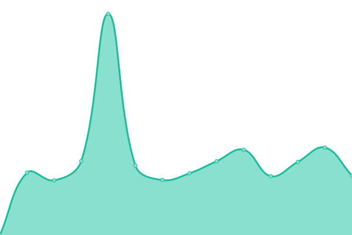

# [📈 Live Status](https://ischaojie.github.io/doup): <!--live status--> **🟧 Partial outage**

This repository contains the open-source uptime monitor and status page for [chaojie](https://blog.chaojie.fun/), powered by [Upptime](https://github.com/upptime/upptime).

With [Upptime](https://upptime.js.org), you can get your own unlimited and free uptime monitor and status page, powered entirely by a GitHub repository. We use [Issues](https://github.com/ischaojie/doup/issues) as incident reports, [Actions](https://github.com/ischaojie/doup/actions) as uptime monitors, and [Pages](https://ischaojie.github.io/doup) for the status page.

<!--start: status pages-->
<!-- This summary is generated by Upptime (https://github.com/upptime/upptime) -->
<!-- Do not edit this manually, your changes will be overwritten -->
<!-- prettier-ignore -->
| URL | Status | History | Response Time | Uptime |
| --- | ------ | ------- | ------------- | ------ |
|  [Douban](https://www.douban.com) | 🟩 Up | [douban.yml](https://github.com/ischaojie/doup/commits/HEAD/history/douban.yml) | 

 4338ms
     
 | 

<a href="https://ischaojie.github.io/doup/history/douban">98.25%</a>
    

|  [Movie](https://movie.douban.com) | 🟥 Down | [movie.yml](https://github.com/ischaojie/doup/commits/HEAD/history/movie.yml) | 

 2132ms
     
 | 

<a href="https://ischaojie.github.io/doup/history/movie">99.26%</a>
    

|  [book](https://book.douban.com) | 🟥 Down | [book.yml](https://github.com/ischaojie/doup/commits/HEAD/history/book.yml) | 

 2239ms
     
 | 

<a href="https://ischaojie.github.io/doup/history/book">99.10%</a>
    

<!--end: status pages-->

[**Visit our status website →**](https://ischaojie.github.io/doup)

## 📄 License

- Powered by: [Upptime](https://github.com/upptime/upptime)
- Code: [MIT](./LICENSE) © [chaojie](https://blog.chaojie.fun/)
- Data in the `./history` directory: [Open Database License](https://opendatacommons.org/licenses/odbl/1-0/)
